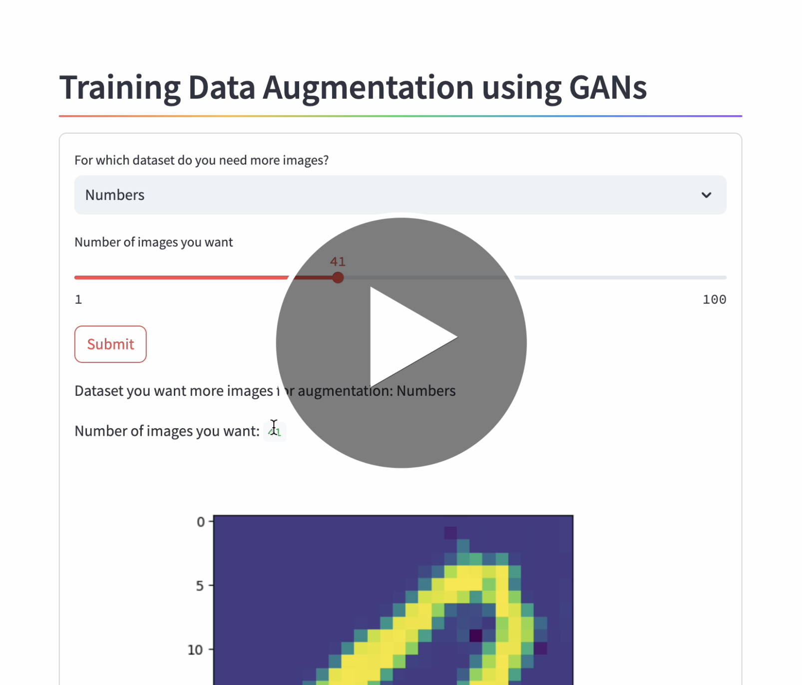
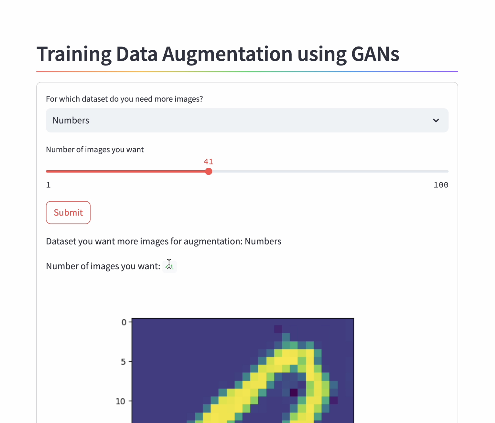
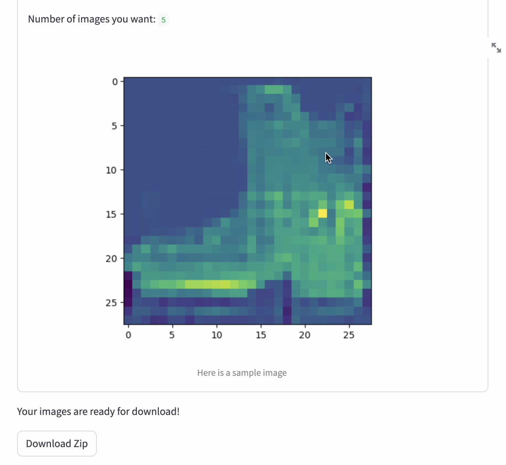

# Description

The video below gives a demo of the Application created using Streamlit for data augmentation using GAN:  

The model uses pytorch lightning module to create Generative Adversarial Networks (GAN) which has been used for data augmentation. The Generator and the discriminator train each other till the point where generator gets pretty good at generating real like images.  

The model currently is trained on two datasets – MNIST and FashionMNIST. The generator can create new images from random values which can fool the discriminator. Since the images can fool the discriminator, they can be assumed to be like the ones seen in the training data and hence can be used to beef up the training dataset.  

### Demo

The images below show the interface of the application along with the quality of images created  

    

The second images shows a "shoe" created for the FashionMNIST dataset along with a download link for getting new images  

    
